# Object Detection Through Machine Learning on Raspberry PI

| **Name** | **High School** | **Field of Interest** | **Grade** |
|:--:|:--:|:--:|:--:|
| Yash C | Westmont High School | Computer Engineering | Rising Senior |
|:--:|:--:|:--:|:--:|

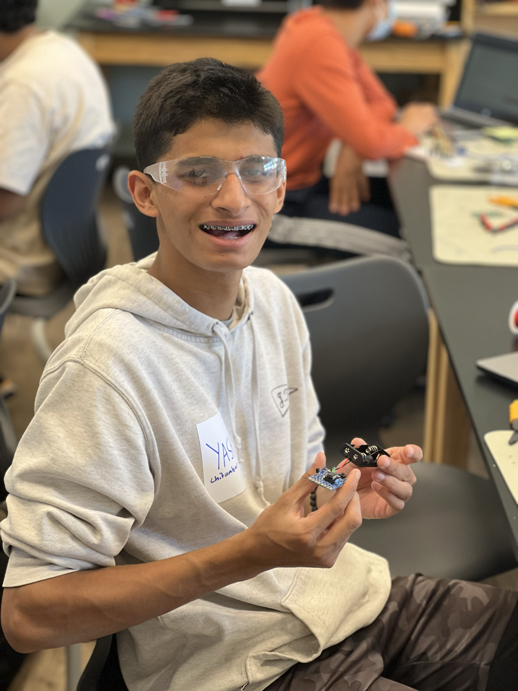{:height="50%" width="50%"}

# Final Milestone

In my third and final milestone, I implemeted an object detection software using tensorflow lite that allowed me to implemnt realtime objectdetection on the raspberry PI. I utilizeds google's tensorflow github library to use thier optimzed tensorflow computer vision model on the raspberry PI for fast realtime object detection and computer vision.

## Progress

To impletment tensorflow lite on a raspberry PI, I needed to download different packages than what I already had from downloading tensorflow 2.1 on my raspberry PI. To do this, I used the command below to install the nessary packages in my virtual library:

```bash
pip install tflite-support
# I have already downloaded openCV in a previos milestone
# Open CV is nessesary to run the live streamed computer vision model
pip install openCV-python
```
After installing the nesseary packages, I needed to get the computer vision model that runs on the raspberry PI made by tensorflow off github. To do this I cloned the "examples" from the tensorflow library off github

```bash
git clone https://github.com/tensorflow/examples.git
```

Downloading this library allows me to get access to all the possible models that can work on a raspberry PI using tensorflow lite. However, I only be using the object detection library for what I am doing.

# Second Milestone

In my second milestone, I developed my own model and trained it in order to be able to recognize the difference between an iphone an an android phone. I utilzed a scrapper program that would download hundreds of images off the web and then label these images for the yolov5 program and roboflow model to train on. I would then use these train models to create a computer vision program that can recognize the difference.

## Progress
To train a computer model, the first thing that I need are images, lots of them. Small models need only a couple hundred images but larger computer vision models are trained on hundreds of thousands of images. Since it would take a long time to induviudaly download images of the internet I used a web scraper to this job for me. I can specify the amount of images I want to download for each quiery that I want to search.

| **Search Quire** | **Number of images** |
|:--:|:--:|
| Iphone | 100 |
|:--:|:--:|
| Iphone 12 | 20 |
|:--:|:--:|
| Iphone 13 | 20 |
|:--:|:--:|
| Iphone 14 | 20 |
|:--:|:--:|
| Google Pixel 4 | 20 |
|:--:|:--:|
| Google Pixel 6 | 20 |
|:--:|:--:|
| Google Pixels | 100 |
|:--:|:--:|
| OnePlus 7pro | 50 |
|:--:|:--:|
| OnePlus phone | 50 |
|:--:|:--:|
| Samsung S21 | 20 |
|:--:|:--:|
| Samsung S22 | 20 |
|:--:|:--:|
| **Total Number of Images** | **480** |
|:--:|:--:|

I utilized this <a href=" ttps://github.com/ultralytics/yolov5"> web scraper </a> scrapper of github. It searches google images for the top images for each quiry and downloads ammount that I desire for each category.

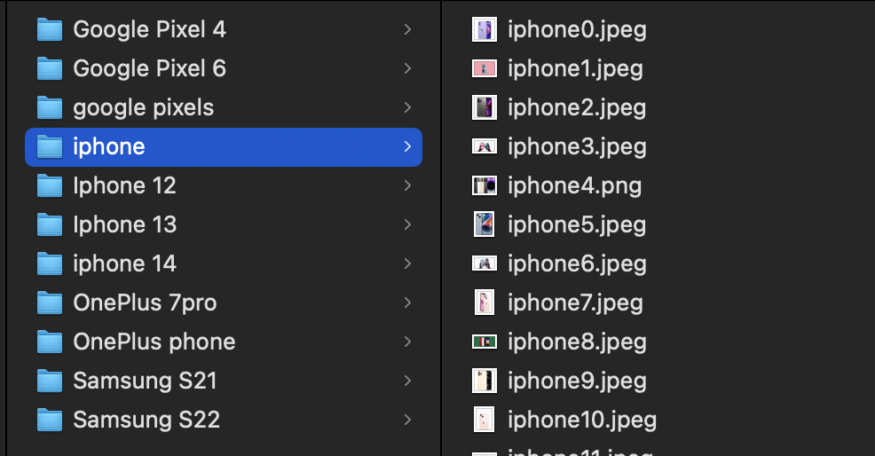

I then upload all the images all the images to robotflow, a free labeling and computer vision tool that works with yolov5 to label and train a model on.

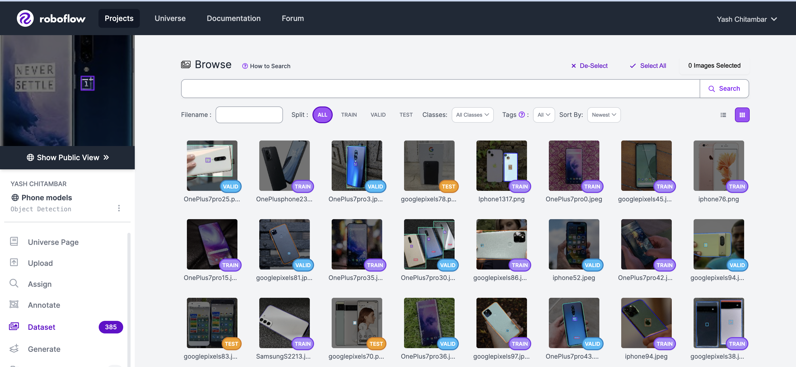

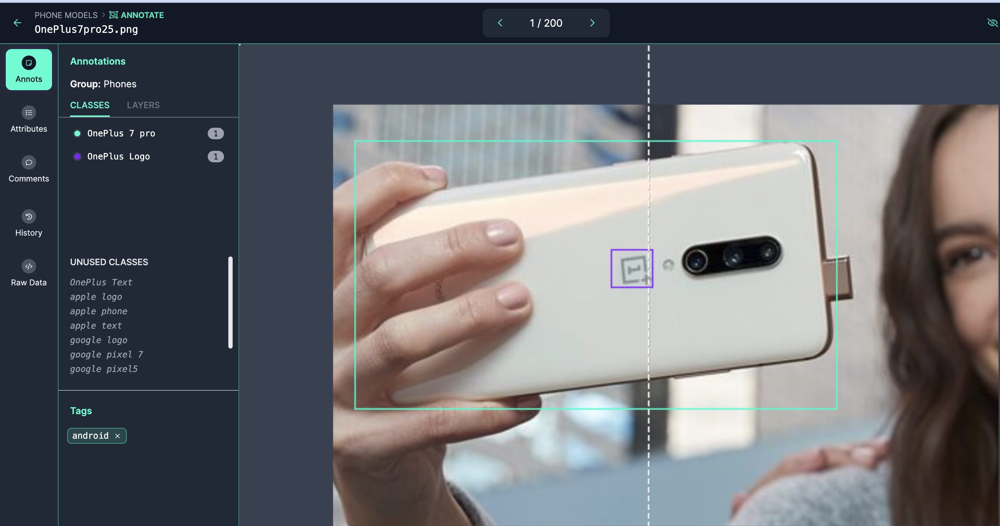

Taking these images, I uploaded them into roboflow and started labeling them. I labeled the model of the phone (wheter it was an iphone, google pixel, oneplus, etc...), the logo of each phone (each company logo on the phone), and if here was any text on the phone (company brand like "Samsung","Google,"Oneplus") in hopes that if the model could recognize any one of these catigories it could recognize whether the phone was an apple or an android.

After labeling these all the images and throwing out any null images (images that could not be used for training) purposes. I trained the model through model through roboflows free training program. The initial results were quite positive as the model could recognize the correct phone 78% of the time with mAP of 84%. Veiwing the live web cam feed the model works in real time and can correctly detect different types of phones

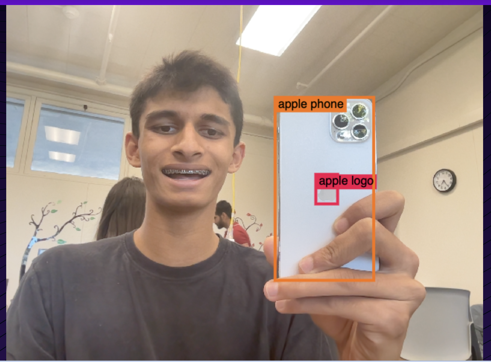

While the intial results were fantastic, I wanted to see if I could improve the model even further. Reaserhcing on ways to imporve, one way to make the model more accurate is to feed the train the model on more images. However, we have already searched for the top image results online and it would be quite difficult to find new quailty images to feed the model. Instead, I augmented the images; augmenting the images creates copies of the images and changing them in some way shape or form (by rotating the images, croping the images, fliping the images). By doing this, the model created 600 "new" images that model can use to train on and get better

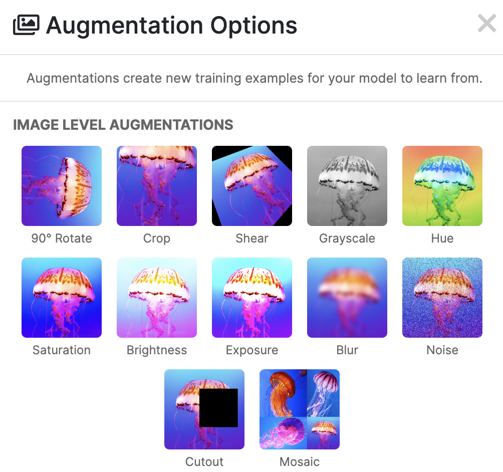

Another thing that I did was utilize transfer learning. Essential whenver you train a model, it recognizes patterns to be able to recognize objects. But when a ne train model is compiled it does not used the previously trained model to automatically recognzie these patterns and build upon them. This is where transferlearning comes into play. Transfer learning allows for training models to look at previous builds in order to build on previous training models learning, to save time and build a much more accurate model.

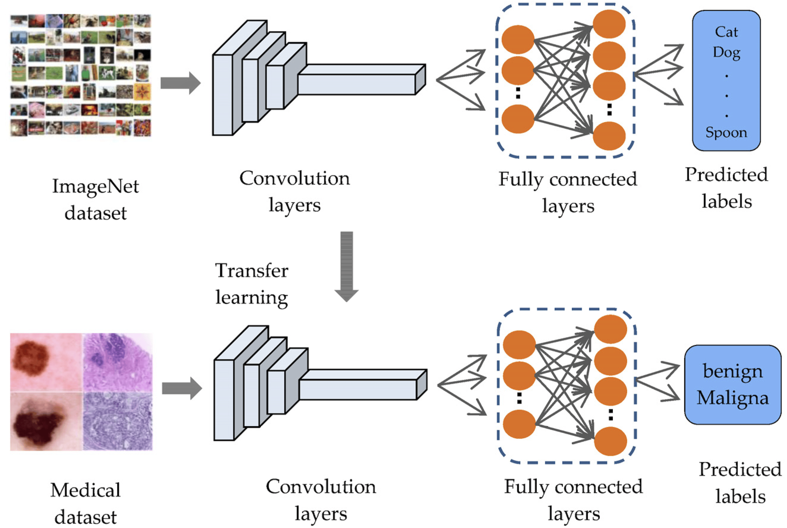

Through augmentation and transfer learning, My model improved by nearly 10 percent.

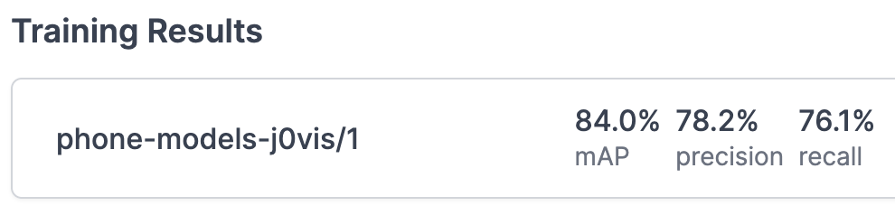

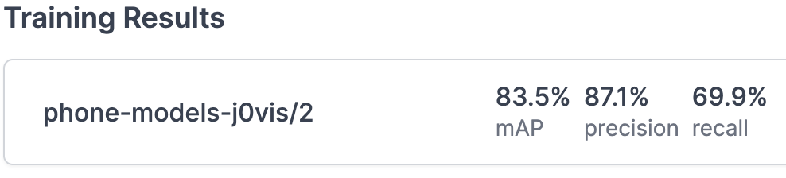


While training the model on roboflow worked well, I also wanted to train the model my self to see if wheter my accuracy would change. In order for this to be possible I would need acces to a GPU to be able to handdale the advanced processing that is infovleved to train a computer vision model. Roboflow lets me donwload my labeld images so that I can feed it into a training program. I then utilized google colabs to train my model becasue it provides a free GPU for me to train my images on. I then ran some code that would access my labeled images through the roboflow API and than ran train.py program in YOLOv5. I set the model to be trained with 50 iterations (epochs) the model that was trained in used over 100 epochs. In roboflow, the expected model accuary when trained with 50 epoch is around 71-75%. My trained model came out toe be around 74.2% accurate which matches with the predectied results.


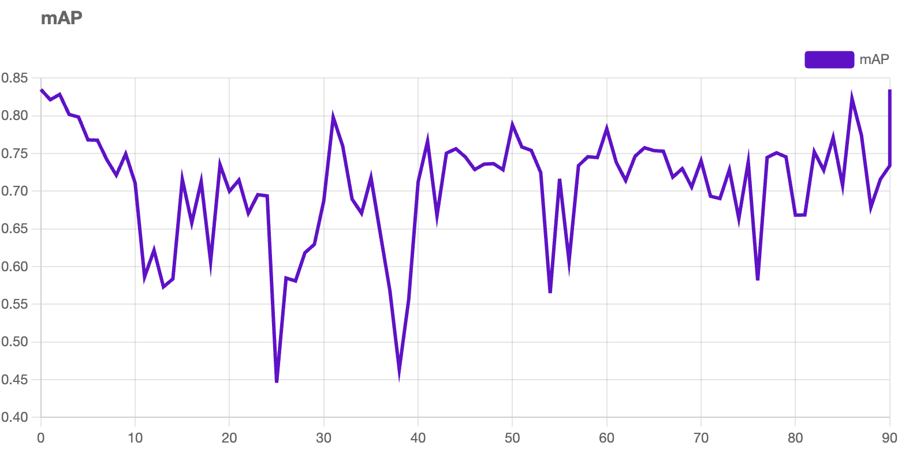

Roboflow predicted training model results based on their model training

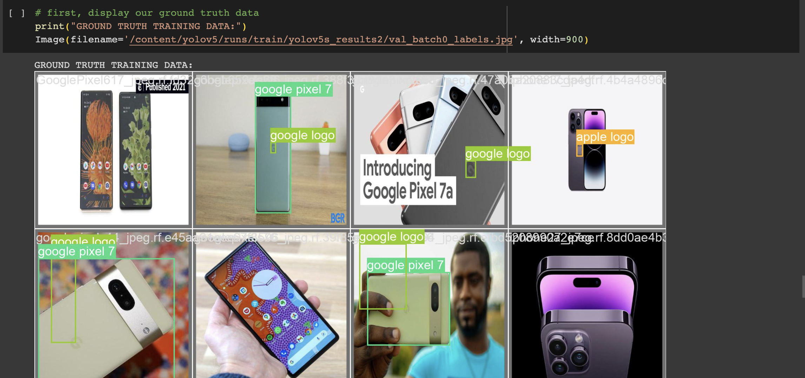

Results from my trained model

## Chalenges

One of the biggest challenges was labeling images due to how time instesive it is. Additinolly making use that labels are correctly placed and that bounding boxes accuratly fit the phone proves quite tedious. Another challenge that I faced was finding enough images that met my requirements. I needed images of phones back side, since I did not want the model to be able to recognize phones from the front. Finding enough images to be able to train the model proved difficult becasue models need a large amount of images in order to be trained. To solve this problem I utilzies augmentation to provide similar images to the ones that I found this time to meet the required picutre threshold to run the training model.

Another thing that was difficult was training the model myself. Orginially, I watned to train the model using a raspberry PI. This would not work for a variety of reasons, for one the raspberry PI does not have a GPU which is required to train a model using YOLOv5, and two the raspberry PI does not have enough proccesing power to be able to train it using CPU power. As a result, I used google colabs and accessed a free GPU to train the models.

## Next Steps

The next step is to make the computer vision a real time tracking model on a raspberry PI. Given the PI's limited processesing power, I think it would be quite impressive to make the PI accuratly track objects with out any lag.

# First Milestone

<iframe width="560" height="315" src="https://www.youtube.com/embed/Z9y6cRenPV8" title="YouTube video player" frameborder="0" allow="accelerometer; autoplay; clipboard-write; encrypted-media; gyroscope; picture-in-picture; web-share" allowfullscreen></iframe>

My project, Raspberry Pi Object Dection through machine learning, utilizes tensorflow and YOLOv5 API in order to detect objects. My first milestone was installing OpenCV, TensorFlow, and other nessesary libraries onto the raspberry PI. To access the webcamera(), I use openCV in order to take pictures/videos and store them on the raspberry Pi. I then utilize tensorflow and the YOLOv5 model in order to recognize objects. I then wrote my own code in the detect.py program order for the raspberry PI to take a picture and then automatically analize it utilizing the model and display the result.

## Nessesary equipment:
* Computer
* Raspberry Pi 4 (64 bit)
* Web Cam (Arducam is what I used)
* 4k Video Capture Card

## Progress
In order for the project to work, it is nessesary to install the packages to run yolov5. PIP comes pre installed onto the raspberry pi 4. PIP allows for the raspberry Pi to download the nessesary packages on to the raspberry pi through the terminal.When installing packges its important to create a virtual envoirment in order to store your libraries. This prevents you from having any dependency issues when utilizing your installed libraries. To create a virtual envoirment I ran the command below in my "projects" folder

```bash
-m virtualenv env # this creates a virtual enviorment called env
```
To access my enviorment I ran the following code.

```bash
source env/bin/activate 
```

I installed openCV and Tensorflow utilzing the following commands.

```bash
pip install openCV-python
sudo apt install libatlas-base-dev
pip3 install tensorflow
```

OpenCV is a library that allows us to edit, access, and manipulate images and videos through python
Tensorflow is a libary made by google that allows for induviduals to create and run machine learning models on their computer

Once all the libaries are installed I cloned the <a href=" ttps://github.com/ultralytics/yolov5"> YoloV5 </a> in order to get the machine learning model and be able to run the computer vision code.

Running the program: detect.py and feeding it an image

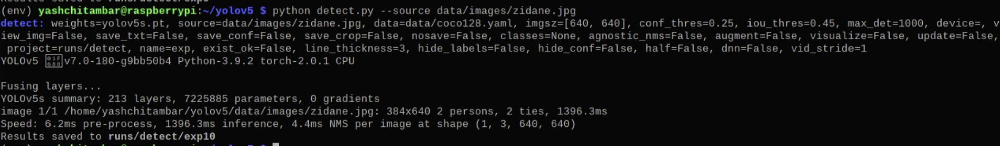
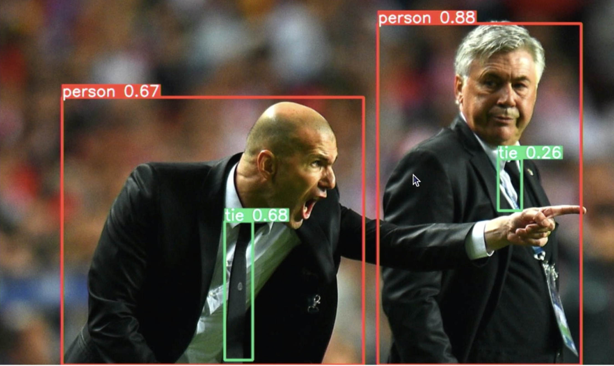

The result of this was the raspberry PI being able to recognize the two people in the image, Zidane and Ancelotti, and thier ties. Yolov5 can recognize 80 different objects using its pretrained model. Yolov5 is one of  many tensorflow computer vision models avaiable to use. Yolov5 works great on a raspberry pi becasue it is one of the fastest computer vision models availabe and it does not use alot of proccessing power on the raspberry pi.

I Modified the yolov5 detect.py code so that when it runs it would automatically take a picture using the aurdocam and run the image on the computer vision model to detect objects. The code for this is in the first milestone code section.

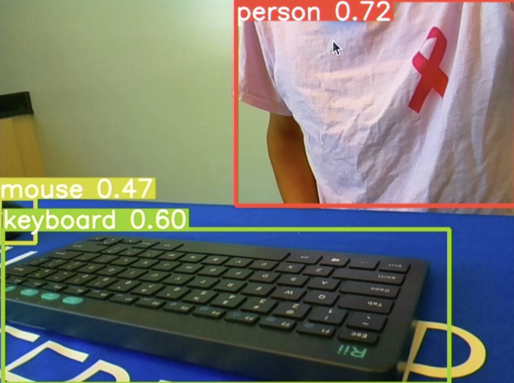

## Challenges

While downloading openCV is realtivly easy, downloading tensorflow proves quite difficult. Depending on what you are doing you need to download the right version of tensorflow. The version that I downloaded is tensorflow 2.1. Some Machine Models require tensorflow lite to be installed on to the raspberry pi so making sure to download the right version of tensorflow is a must. Additionally, tensorflow needs additional packages to in order to run. There are alot off different things that make downloading tensorflow on the rapsberry pi quite difficult.

Another challenge I faced was directory issues. Orginally when I used the detect.py program, I would have to store the image in the same folder as the detect.py program. This is why I edited the program to automatically take a picture for me so that way I do not have to keep moving image paths around.

## Next Steps

The next steps for me are to be able to train my own computer vison model to be able to detect things that I want. I want to see if I can detect the difference between an Iphone an an Android phone. I will collect and label a data set of phones and then see if it can recognize the difference between the two phones by training the model myself.

# Schematics 
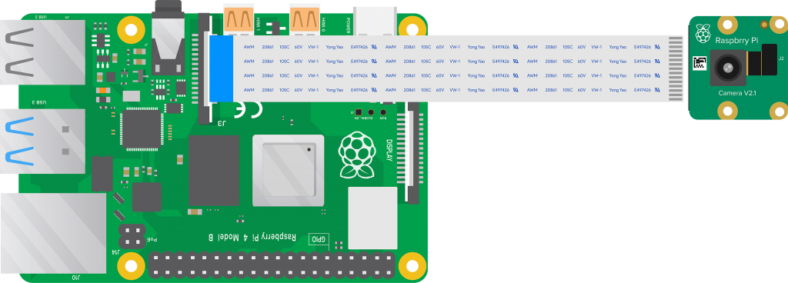

# Code
All code for this project is written in python

## Milestone One Code
This code allows for the user to take a picture and directly get an output on wheter any objects were detected and what objects were detected.
detect.py (modified to take a picture using webcam and automatically analyze image):
```python
import argparse
import os
import platform
import sys
from pathlib import Path

import torch

FILE = Path(__file__).resolve()
ROOT = FILE.parents[0]  # YOLOv5 root directory
if str(ROOT) not in sys.path:
    sys.path.append(str(ROOT))  # add ROOT to PATH
ROOT = Path(os.path.relpath(ROOT, Path.cwd()))  # relative

from models.common import DetectMultiBackend
from utils.dataloaders import IMG_FORMATS, VID_FORMATS, LoadImages, LoadScreenshots, LoadStreams
from utils.general import (LOGGER, Profile, check_file, check_img_size, check_imshow, check_requirements, colorstr, cv2,
                           increment_path, non_max_suppression, print_args, scale_boxes, strip_optimizer, xyxy2xywh)
from utils.plots import Annotator, colors, save_one_box
from utils.torch_utils import select_device, smart_inference_mode


@smart_inference_mode()
def takePicture():
    p = "images/image.jpg" #saves image path to images folder
    cap = cv2.VideoCapture(0) #captures image frame from webcam

    ret, frame = cap.read()

    if ret:
        cv2.imwrite(p,frame) # saves image to path

    cap.release()
    return p #returns path
def run(
        weights=ROOT / 'yolov5s.pt',  # model path or triton URL
        source=ROOT / takePicture(),  # file/dir/URL/glob/screen/0(webcam)
        data=ROOT / 'data/coco128.yaml',  # dataset.yaml path
        imgsz=(640, 640),  # inference size (height, width)
        conf_thres=0.25,  # confidence threshold
        iou_thres=0.45,  # NMS IOU threshold
        max_det=1000,  # maximum detections per image
        device='',  # cuda device, i.e. 0 or 0,1,2,3 or cpu
        view_img=False,  # show results
        save_txt=False,  # save results to *.txt
        save_conf=False,  # save confidences in --save-txt labels
        save_crop=False,  # save cropped prediction boxes
        nosave=False,  # do not save images/videos
        classes=None,  # filter by class: --class 0, or --class 0 2 3
        agnostic_nms=False,  # class-agnostic NMS
        augment=False,  # augmented inference
        visualize=False,  # visualize features
        update=False,  # update all models
        project=ROOT / 'runs/detect',  # save results to project/name
        name='exp',  # save results to project/name
        exist_ok=False,  # existing project/name ok, do not increment
        line_thickness=3,  # bounding box thickness (pixels)
        hide_labels=False,  # hide labels
        hide_conf=False,  # hide confidences
        half=False,  # use FP16 half-precision inference
        dnn=False,  # use OpenCV DNN for ONNX inference
        vid_stride=1,  # video frame-rate stride
):
    source = str(source)
    save_img = not nosave and not source.endswith('.txt')  # save inference images
    is_file = Path(source).suffix[1:] in (IMG_FORMATS + VID_FORMATS)
    is_url = source.lower().startswith(('rtsp://', 'rtmp://', 'http://', 'https://'))
    webcam = source.isnumeric() or source.endswith('.streams') or (is_url and not is_file)
    screenshot = source.lower().startswith('screen')
    if is_url and is_file:
        source = check_file(source)  # download

    # Directories
    save_dir = increment_path(Path(project) / name, exist_ok=exist_ok)  # increment run
    (save_dir / 'labels' if save_txt else save_dir).mkdir(parents=True, exist_ok=True)  # make dir

    # Load model
    device = select_device(device)
    model = DetectMultiBackend(weights, device=device, dnn=dnn, data=data, fp16=half)
    stride, names, pt = model.stride, model.names, model.pt
    imgsz = check_img_size(imgsz, s=stride)  # check image size

    # Dataloader
    bs = 1  # batch_size
    if webcam:
        view_img = check_imshow(warn=True)
        dataset = LoadStreams(source, img_size=imgsz, stride=stride, auto=pt, vid_stride=vid_stride)
        bs = len(dataset)
    elif screenshot:
        dataset = LoadScreenshots(source, img_size=imgsz, stride=stride, auto=pt)
    else:
        dataset = LoadImages(source, img_size=imgsz, stride=stride, auto=pt, vid_stride=vid_stride)
    vid_path, vid_writer = [None] * bs, [None] * bs

    # Run inference
    model.warmup(imgsz=(1 if pt or model.triton else bs, 3, *imgsz))  # warmup
    seen, windows, dt = 0, [], (Profile(), Profile(), Profile())
    for path, im, im0s, vid_cap, s in dataset:
        with dt[0]:
            im = torch.from_numpy(im).to(model.device)
            im = im.half() if model.fp16 else im.float()  # uint8 to fp16/32
            im /= 255  # 0 - 255 to 0.0 - 1.0
            if len(im.shape) == 3:
                im = im[None]  # expand for batch dim

        # Inference
        with dt[1]:
            visualize = increment_path(save_dir / Path(path).stem, mkdir=True) if visualize else False
            pred = model(im, augment=augment, visualize=visualize)

        # NMS
        with dt[2]:
            pred = non_max_suppression(pred, conf_thres, iou_thres, classes, agnostic_nms, max_det=max_det)

        # Second-stage classifier (optional)
        # pred = utils.general.apply_classifier(pred, classifier_model, im, im0s)

        # Process predictions
        for i, det in enumerate(pred):  # per image
            seen += 1
            if webcam:  # batch_size >= 1
                p, im0, frame = path[i], im0s[i].copy(), dataset.count
                s += f'{i}: '
            else:
                p, im0, frame = path, im0s.copy(), getattr(dataset, 'frame', 0)

            p = Path(p)  # to Path
            save_path = str(save_dir / p.name)  # im.jpg
            txt_path = str(save_dir / 'labels' / p.stem) + ('' if dataset.mode == 'image' else f'_{frame}')  # im.txt
            s += '%gx%g ' % im.shape[2:]  # print string
            gn = torch.tensor(im0.shape)[[1, 0, 1, 0]]  # normalization gain whwh
            imc = im0.copy() if save_crop else im0  # for save_crop
            annotator = Annotator(im0, line_width=line_thickness, example=str(names))
            if len(det):
                # Rescale boxes from img_size to im0 size
                det[:, :4] = scale_boxes(im.shape[2:], det[:, :4], im0.shape).round()

                # Print results
                for c in det[:, 5].unique():
                    n = (det[:, 5] == c).sum()  # detections per class
                    s += f"{n} {names[int(c)]}{'s' * (n > 1)}, "  # add to string

                # Write results
                for *xyxy, conf, cls in reversed(det):
                    if save_txt:  # Write to file
                        xywh = (xyxy2xywh(torch.tensor(xyxy).view(1, 4)) / gn).view(-1).tolist()  # normalized xywh
                        line = (cls, *xywh, conf) if save_conf else (cls, *xywh)  # label format
                        with open(f'{txt_path}.txt', 'a') as f:
                            f.write(('%g ' * len(line)).rstrip() % line + '\n')

                    if save_img or save_crop or view_img:  # Add bbox to image
                        c = int(cls)  # integer class
                        label = None if hide_labels else (names[c] if hide_conf else f'{names[c]} {conf:.2f}')
                        annotator.box_label(xyxy, label, color=colors(c, True))
                    if save_crop:
                        save_one_box(xyxy, imc, file=save_dir / 'crops' / names[c] / f'{p.stem}.jpg', BGR=True)

            # Stream results
            im0 = annotator.result()
            if view_img:
                if platform.system() == 'Linux' and p not in windows:
                    windows.append(p)
                    cv2.namedWindow(str(p), cv2.WINDOW_NORMAL | cv2.WINDOW_KEEPRATIO)  # allow window resize (Linux)
                    cv2.resizeWindow(str(p), im0.shape[1], im0.shape[0])
                cv2.imshow(str(p), im0)
                cv2.waitKey(1)  # 1 millisecond

            # Save results (image with detections)
            if save_img:
                if dataset.mode == 'image':
                    cv2.imwrite(save_path, im0)
                else:  # 'video' or 'stream'
                    if vid_path[i] != save_path:  # new video
                        vid_path[i] = save_path
                        if isinstance(vid_writer[i], cv2.VideoWriter):
                            vid_writer[i].release()  # release previous video writer
                        if vid_cap:  # video
                            fps = vid_cap.get(cv2.CAP_PROP_FPS)
                            w = int(vid_cap.get(cv2.CAP_PROP_FRAME_WIDTH))
                            h = int(vid_cap.get(cv2.CAP_PROP_FRAME_HEIGHT))
                        else:  # stream
                            fps, w, h = 30, im0.shape[1], im0.shape[0]
                        save_path = str(Path(save_path).with_suffix('.mp4'))  # force *.mp4 suffix on results videos
                        vid_writer[i] = cv2.VideoWriter(save_path, cv2.VideoWriter_fourcc(*'mp4v'), fps, (w, h))
                    vid_writer[i].write(im0)

        # Print time (inference-only)
        LOGGER.info(f"{s}{'' if len(det) else '(no detections), '}{dt[1].dt * 1E3:.1f}ms")

    # Print results
    t = tuple(x.t / seen * 1E3 for x in dt)  # speeds per image
    LOGGER.info(f'Speed: %.1fms pre-process, %.1fms inference, %.1fms NMS per image at shape {(1, 3, *imgsz)}' % t)
    if save_txt or save_img:
        s = f"\n{len(list(save_dir.glob('labels/*.txt')))} labels saved to {save_dir / 'labels'}" if save_txt else ''
        LOGGER.info(f"Results saved to {colorstr('bold', save_dir)}{s}")
    if update:
        strip_optimizer(weights[0])  # update model (to fix SourceChangeWarning)


def parse_opt():
    parser = argparse.ArgumentParser()
    parser.add_argument('--weights', nargs='+', type=str, default=ROOT / 'yolov5s.pt', help='model path or triton URL')
    parser.add_argument('--source', type=str, default=ROOT / 'images/image.jpg', help='file/dir/URL/glob/screen/0(webcam)')
    parser.add_argument('--data', type=str, default=ROOT / 'data/coco128.yaml', help='(optional) dataset.yaml path')
    parser.add_argument('--imgsz', '--img', '--img-size', nargs='+', type=int, default=[640], help='inference size h,w')
    parser.add_argument('--conf-thres', type=float, default=0.25, help='confidence threshold')
    parser.add_argument('--iou-thres', type=float, default=0.45, help='NMS IoU threshold')
    parser.add_argument('--max-det', type=int, default=1000, help='maximum detections per image')
    parser.add_argument('--device', default='', help='cuda device, i.e. 0 or 0,1,2,3 or cpu')
    parser.add_argument('--view-img', action='store_true', help='show results')
    parser.add_argument('--save-txt', action='store_true', help='save results to *.txt')
    parser.add_argument('--save-conf', action='store_true', help='save confidences in --save-txt labels')
    parser.add_argument('--save-crop', action='store_true', help='save cropped prediction boxes')
    parser.add_argument('--nosave', action='store_true', help='do not save images/videos')
    parser.add_argument('--classes', nargs='+', type=int, help='filter by class: --classes 0, or --classes 0 2 3')
    parser.add_argument('--agnostic-nms', action='store_true', help='class-agnostic NMS')
    parser.add_argument('--augment', action='store_true', help='augmented inference')
    parser.add_argument('--visualize', action='store_true', help='visualize features')
    parser.add_argument('--update', action='store_true', help='update all models')
    parser.add_argument('--project', default=ROOT / 'runs/detect', help='save results to project/name')
    parser.add_argument('--name', default='exp', help='save results to project/name')
    parser.add_argument('--exist-ok', action='store_true', help='existing project/name ok, do not increment')
    parser.add_argument('--line-thickness', default=3, type=int, help='bounding box thickness (pixels)')
    parser.add_argument('--hide-labels', default=False, action='store_true', help='hide labels')
    parser.add_argument('--hide-conf', default=False, action='store_true', help='hide confidences')
    parser.add_argument('--half', action='store_true', help='use FP16 half-precision inference')
    parser.add_argument('--dnn', action='store_true', help='use OpenCV DNN for ONNX inference')
    parser.add_argument('--vid-stride', type=int, default=1, help='video frame-rate stride')
    opt = parser.parse_args()
    opt.imgsz *= 2 if len(opt.imgsz) == 1 else 1  # expand
    print_args(vars(opt))
    return opt


def main(opt):
    check_requirements(ROOT / 'requirements.txt', exclude=('tensorboard', 'thop'))
    run(**vars(opt))


if __name__ == '__main__':
    opt = parse_opt()
    main(opt)
```
Picture testing code on Raspberry Pi 4
``` python
import cv2

cap = cv2.VideoCapture(0) # captures frame from ArduCam

ret, frame = cap.read() 

if ret:
cv2.imwrite("image.jpg",frame) # saves frame and names it "image.jpg"


cap.release()
```
Video testing code on Raspberry Pi 4

``` python
import cv2
 
vid = cv2.VideoCapture(0) # define a video capture object
 
while(True):

    ret, frame = vid.read() # Capture the video frame by frame
 
    
    cv2.imshow('frame', frame) # Display the resulting frame
     
    if cv2.waitKey(1) & 0xFF == ord('q'):  # the 'q' button is set as the quitting button 
        break
 
vid.release() # After the loop release the cap object
cv2.destroyAllWindows() # Destroy all the windows
```

# Bill of Materials
Here is the bill of materials for my project, excluding a peripherals and a computer these are the nessary parts in order to recreate this project.

| **Part** | **Note** | **Price** | **Link** |
|:--:|:--:|:--:|:--:|
| Raspberry Pi 4(64 bit)| Is a credit card sized computer that does a majority of the processing for the Computer Vision software | $82.00 | <a href="https://www.amazon.com/Arduino-A000066-ARDUINO-UNO-R3/dp/B008GRTSV6/](https://www.amazon.com/Raspberry-Model-2019-Quad-Bluetooth/dp/B07TC2BK1X/ref=asc_df_B07TD42S27/?tag=&linkCode=df0&hvadid=380013417597&hvpos=&hvnetw=g&hvrand=7380946922219675202&hvpone=&hvptwo=&hvqmt=&hvdev=c&hvdvcmdl=&hvlocint=&hvlocphy=9032183&hvtargid=pla-774661502856&ref=&adgrpid=77922879259&th=1"> Link </a> |
|:--:|:--:|:--:|:--:|
| Arducam for Raspberry Pi Camera Module 3 | Is a small modular camera that plugs directly into the Raspberry Pi's CSI port | $31.00 | <a href="https://www.amazon.com/Arduino-A000066-ARDUINO-UNO-R3/dp/B008GRTSV6/](https://www.amazon.com/dp/B0C5D97DRJ/ref=sspa_dk_detail_4?psc=1&pd_rd_i=B0C5D97DRJ&pd_rd_w=wkv1F&content-id=amzn1.sym.f734d1a2-0bf9-4a26-ad34-2e1b969a5a75&pf_rd_p=f734d1a2-0bf9-4a26-ad34-2e1b969a5a75&pf_rd_r=QFNHR0E4M43AT1QZ6JVS&pd_rd_wg=VsP9B&pd_rd_r=9ab21125-f61c-4264-b4c7-9605bedb7164&s=electronics&sp_csd=d2lkZ2V0TmFtZT1zcF9kZXRhaWw"> Link </a> |
|:--:|:--:|:--:|:--:|
| 4K HDMI Video Capture Card | Used as an input HDMI so that the Raspberry PI can be displayed on computer by projecting it as a webcam via usb | $16.98 | <a href="https://www.amazon.com/Arduino-A000066-ARDUINO-UNO-R3/dp/B008GRTSV6/](https://www.amazon.com/Capture-Streaming-Broadcasting-Conference-Teaching/dp/B09FLN63B3/ref=asc_df_B09FLN63B3/?tag=hyprod-20&linkCode=df0&hvadid=545942253969&hvpos=&hvnetw=g&hvrand=10440125318267030833&hvpone=&hvptwo=&hvqmt=&hvdev=c&hvdvcmdl=&hvlocint=&hvlocphy=9032183&hvtargid=pla-1430729093730&psc=1)](https://www.amazon.com/Capture-Streaming-Broadcasting-Conference-Teaching/dp/B09FLN63B3/ref=asc_df_B09FLN63B3/?tag=hyprod-20&linkCode=df0&hvadid=545942253969&hvpos=&hvnetw=g&hvrand=10440125318267030833&hvpone=&hvptwo=&hvqmt=&hvdev=c&hvdvcmdl=&hvlocint=&hvlocphy=9032183&hvtargid=pla-1430729093730&psc=1"> Link </a> |
|:--:|:--:|:--:|:--:|

# Starter Project
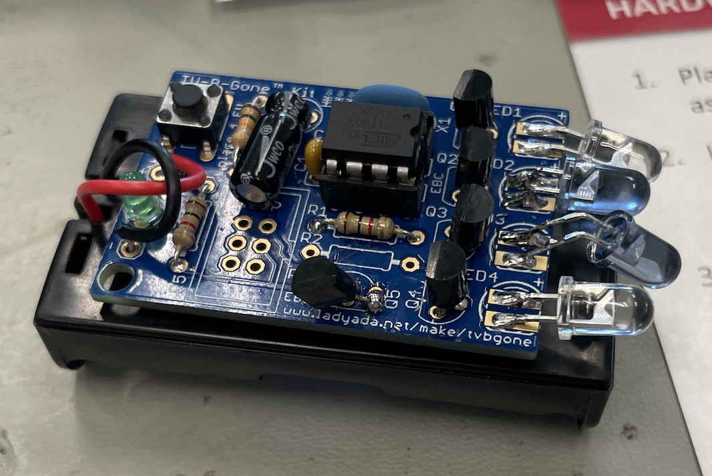

This basic project allows for anyone to turn off any TV by simply turning the device on and pointing it at the TV. It then emmits a IR light that will turn of any TV. The project was great for learning how to solder and understanding basic electronics. The project consists of a batery, resistors, transistors, capasitors, and IR leds. One major struggel that I had during the project was accidentally saudering a transistor backwards. I had to desoder the transistor which took ages to do. None the less the project turned out great, and I was able to turn off my TV!
<iframe width="560" height="315" src="https://www.youtube.com/embed/kJ5Td9zzF3o" title="YouTube video player" frameborder="0" allow="accelerometer; autoplay; clipboard-write; encrypted-media; gyroscope; picture-in-picture; web-share" allowfullscreen></iframe>

## Starter Project Code

```c++
// Code 000 -- Sony, Baur, Neckermann, Otto Versand, Palladium, Quelle, SEI, Sinudyne, Sonolor, Universu
const struct powercode sonyCode PROGMEM = {
  freq_to_timerval(38400), // 38.4 KHz  
  {
  {240, 60},{120, 60},{60 , 60},{120, 60},{60 , 60},
   {120, 60},{60 , 60},{60 , 60},{120, 60},{60 , 60},
   {60 , 60},{60 , 60},{60 , 2700},{240, 60},{120, 60},
   {60 , 60},{120, 60},{60 , 60},{120, 60},{60 , 60},
   {60 , 60},{120, 60},{60 , 60},{60 , 60},{60 , 60},
   {60 , 0}// end of code
  }
};

const uint16_t code_na000Times[] PROGMEM = 
{
   60, 60,
   60, 2700,
   120, 60,
   240, 60,
};

// The structure of compressed code entries
struct IrCode 
{
  uint8_t timer_val;
  uint8_t numpairs;
  uint8_t bitcompression;
  uint16_t const *times;
  uint8_t codes[];
};
const struct IrCode code_na000Code PROGMEM = 
{
        freq_to_timerval(38400),
        26,             // # of pairs
        2,              // # of bits per index
        code_na000Times,
        {
                0xE2,
                0x20,
                0x80,
                0x78,
                0x88,
                0x20,
                0x10,
        }
};
```
