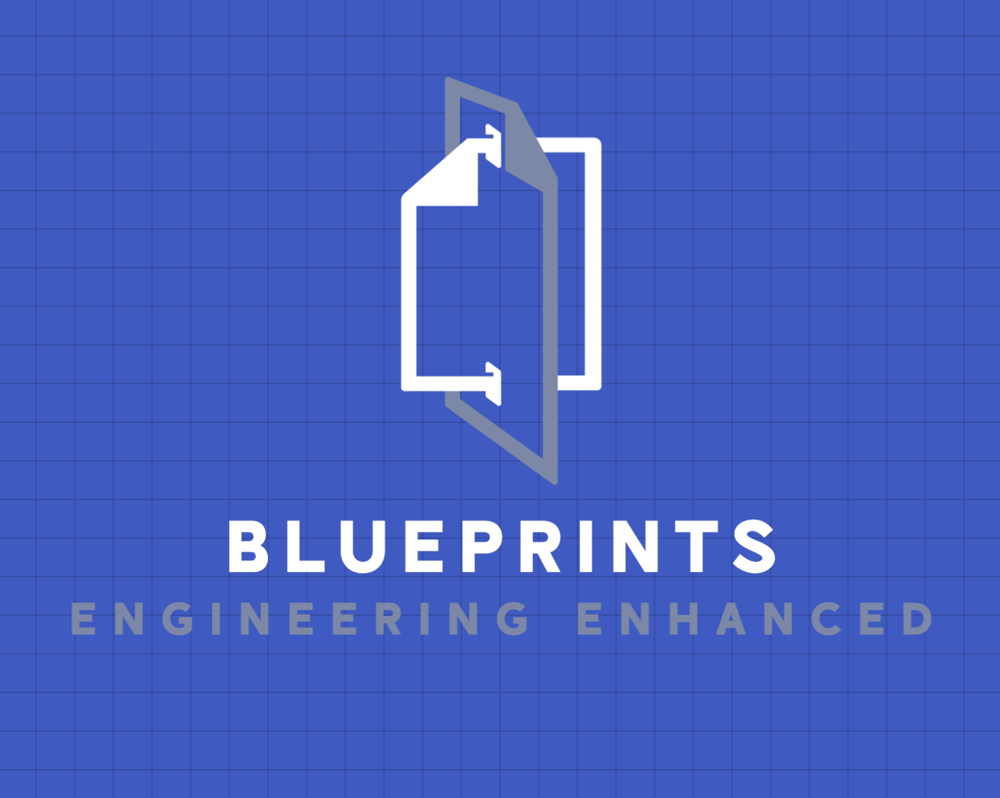
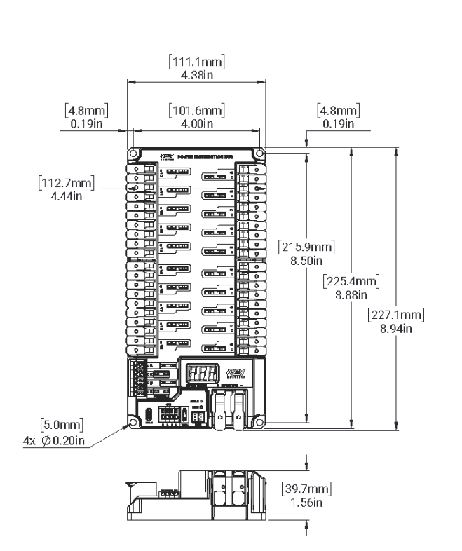
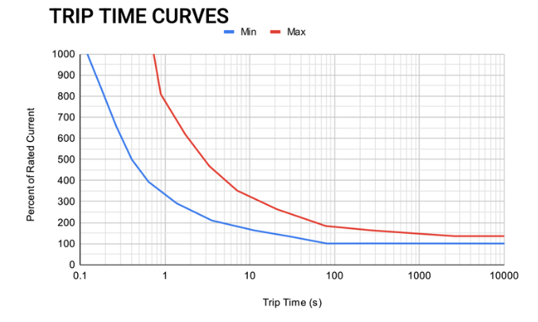
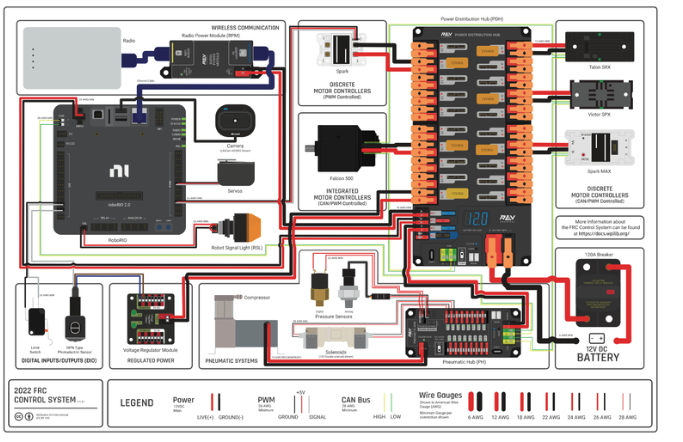
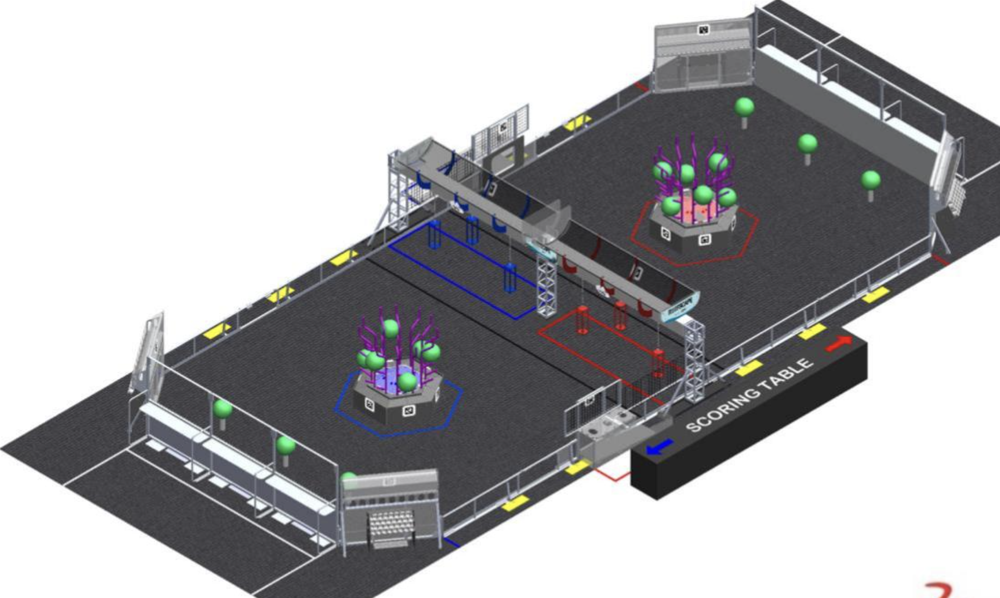
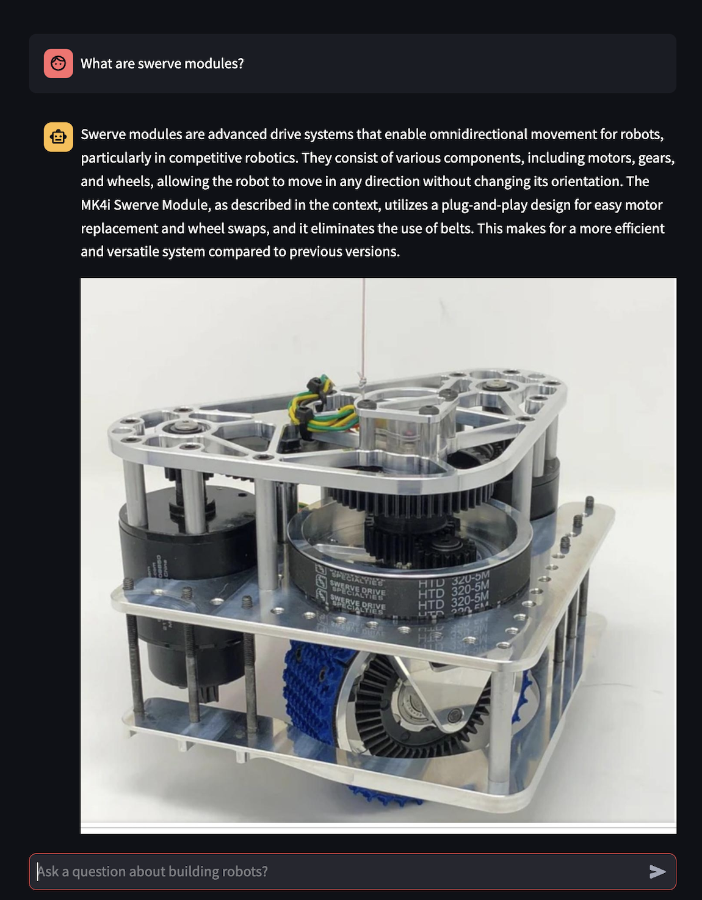
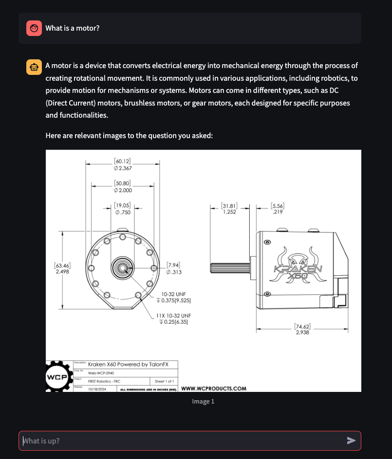

# What is BluePrints: Engineering Enhanced

<p align="center">
    
</p>

BluePrints is an AI-powered chatbot designed to help engineering teams search, analyze, and extract insights from their documentation. It stores and processes engineering diagrams, schematics, API documentation, parts lists, and more, building a Multimodal RAG system that enables advanced search and intelligent summaries.

Currently available for free FRC students, BluePrints helps teams quickly understand designs, components, and rules, making engineering documentation more accessible and actionable. 🚀

# Why BluePrints?
1. Centralized & Multimodal Documentation: Consolidates all engineering documents, diagrams, schematics, and manuals into a single, searchable platform that supports both text and visual content.
2. Enhanced Collaboration & Onboarding: Promotes team collaboration, reduces misunderstandings, and simplifies the onboarding process for new engineers.
3. Quick Troubleshooting & Decision-Making: Enables faster troubleshooting with easy access to specifications and previous design notes, supporting timely decisions.
4. Version Control & Standardization: Tracks document versions and ensures standardized practices across the team, improving consistency and quality.
5. Customizable for Teams & Compliance: Adaptable to different engineering teams (e.g., robotics, product design) and supports regulatory compliance with up-to-date documentation.

# How it Works:

<iframe width="560" height="315" src="https://www.youtube.com/embed/7wrTRztXzFg" title="YouTube video player" frameborder="0" allow="accelerometer; autoplay; clipboard-write; encrypted-media; gyroscope; picture-in-picture; web-share" allowfullscreen></iframe>

Demo on how BluePrints work for FRC documentation!

## Documents Used

BluePrints leverages over 700 pages of detailed engineering schematics, diagrams, and rulebooks used in building FRC robots. By utilizing Unstructured, we break down these documents into thousands of text, image, and table chunks for in-depth analysis. Our custom-built methods enable comprehensive analysis of engineering diagrams and drawings, providing advanced insights to power our Multimodal RAG pipeline.
[Access the FRC Docs Folder](https://drive.google.com/drive/folders/1AoIong1_LW2cgQlHzQRbILSI-UUMfk7g?usp=sharing)

Some of the thousands of images and tabels used:
<p float="left">
    
    
    
    
</p>

## RAG Pipeline
BluePrints uses NOMIC’s GPT4ALL embedding model to process and understand complex engineering documents. This model is seamlessly integrated with the Chroma DB multivector store, enabling the storage of a wide range of data types—images, tables, and text—in both vector and document stores. The integration allows for powerful, multi-modal retrieval and analysis of engineering data. The RAG pipeline, powered by GPT-4o-mini, drives document summarization and advanced analysis, providing clear, actionable insights from engineering schematics, rulebooks, and other complex documentation.

## GUI
BluePrints leverages Streamlit to power the user-friendly chatbot interface for RoboDocs FRC. The chatbot efficiently handles inquiries related to engineering documentation, offering comprehensive summarizations and advanced insights into part functionality and document details. When necessary, it supplements responses with relevant images, diagrams, and schematics, ensuring users receive the most informative and visual context to understand the documentation better.
<p float="left">
    
    
</p>

Private integration of BluePrints is comming soon!
## Integration for Buisness


Integration for buisness to be able to provide private engineering documentation and parts to BluePrints is comming soon! Blueprints will integrate slack and discord to provide docmenation help for engineers on your team.

# Try BluePrints Your Self
You can download the RoboDocs Chat bot and run it privately your self!
Install nessary packages in vurtual environment:

```bash
pip install streamlit openai langchain gpt4all chroma
```
Dowload this zip:
[app and emmbeddings zip](https://drive.google.com/file/d/1RpIubAJ80z87E9CvSYaqWWeuY_YbhkpA/view?usp=sharing)

run app.py using streamlit:

```bash
streamlit run app.py
```

```python
import streamlit as st
import time

from langchain.vectorstores import Chroma
from langchain.storage import InMemoryStore
from langchain_core.messages import SystemMessage, HumanMessage
from langchain_openai import ChatOpenAI
from langchain_core.prompts import ChatPromptTemplate
import uuid


from langchain.schema.document import Document
from langchain.embeddings import OpenAIEmbeddings
from langchain.retrievers.multi_vector import MultiVectorRetriever
from langchain_community.embeddings import GPT4AllEmbeddings


from langchain_core.runnables import RunnablePassthrough, RunnableLambda
from langchain_core.output_parsers import StrOutputParser

from base64 import b64decode
import os
from IPython.display import Image, display
import uuid
from langchain_text_splitters import TextSplitter
import base64
from io import BytesIO
from PIL import Image


gpt4all_embd = GPT4AllEmbeddings()
# The vectorstore to use to index the child chunks
vectorstore = Chroma(embedding_function=gpt4all_embd, persist_directory="./vdb")

# The storage layer for the parent documents
store = InMemoryStore()
id_key = "doc_id"

# The retriever (empty to start)
retriever = MultiVectorRetriever(
    vectorstore=vectorstore,
    docstore=store,
    id_key=id_key,
)

import pickle

def load_pickle(file_path):
    """
    Loads and returns the contents of a pickle file.

    Args:
        file_path (str): Path to the pickle file.

    Returns:
        object: The data stored in the pickle file.
    """
    try:
        with open(file_path, "rb") as file:  # Open file in binary read mode
            return pickle.load(file)
    except Exception as e:
        print(f"Error loading pickle file: {e}")
        return None  # Return None if an error occurs
    
text_summaries = load_pickle("./MM_summaries/text_summaries.pkl")
doc_ids = load_pickle("./doc_ids/doc_ids.pkl")

#doc_texts = [Document(page_content=chunk, metadata={id_key: doc_ids[i]}) for i, chunk in enumerate(text_summaries)]
#retriever.vectorstore.add_documents(doc_texts)
retriever.docstore.mset(list(zip(doc_ids, text_summaries)))


# Add tables
table_summaries = load_pickle("./MM_summaries/table_summaries.pkl")
table_ids = load_pickle("./doc_ids/table_ids.pkl")
table = load_pickle("./pdf_table_chunks.pkl")

#summary_tables = [Document(page_content=summary, metadata={id_key: table_ids[i]}) for i, summary in enumerate(table_summaries)]
#retriever.vectorstore.add_documents(summary_tables)
retriever.docstore.mset(list(zip(table_ids, table)))

# Add image summaries
image_summaries = load_pickle("./MM_summaries/image_summaries.pkl")
img_ids = load_pickle("./doc_ids/img_ids.pkl")
images = load_pickle("./pdf_images_b64.pkl")

#summary_img = [Document(page_content=summary, metadata={id_key: img_ids[i]}) for i, summary in enumerate(image_summaries)]
#retriever.vectorstore.add_documents(summary_img)
retriever.docstore.mset(list(zip(img_ids, images)))

with open("img_ids.pkl", "wb") as file:
    pickle.dump(img_ids, file)

os.environ["OPENAI_API_KEY"] = "------INSERT OPEN AI API KEY------"

def display_base64_image(base64_code):
    # Decode the base64 string to binary
    image_data = base64.b64decode(base64_code)
    # Display the image
    display(Image(data=image_data))

def parse_docs(docs):
    """Split base64-encoded images and texts"""
    b64 = []
    text = []
    for doc in docs:
        try:
            b64decode(doc)
            b64.append(doc)
        except Exception as e:
            text.append(doc)
    return {"images": b64, "texts": text}


def build_prompt(kwargs):

    docs_by_type = kwargs["context"]
    user_question = kwargs["question"]

    context_text = ""
    if len(docs_by_type["texts"]) > 0:
        for text_element in docs_by_type["texts"]:
            context_text += text_element + "\n"

    # construct prompt with context (including images)
    prompt_template = f"""
    Answer the question based only on the following context, which can include text, tables, and the below image.
    Context: {context_text}
    Question: {user_question}
    """

    prompt_content = [{"type": "text", "text": prompt_template}]

    if len(docs_by_type["images"]) > 0:
        for image in docs_by_type["images"]:
            prompt_content.append(
                {
                    "type": "image_url",
                    "image_url": {"url": f"data:image/jpeg;base64,{image}"},
                }
            )

    return ChatPromptTemplate.from_messages(
        [
            HumanMessage(content=prompt_content),
        ]
    )


chain = (
    {
        "context": retriever | RunnableLambda(parse_docs),
        "question": RunnablePassthrough(),
    }
    | RunnableLambda(build_prompt)
    | ChatOpenAI(model="gpt-4o-mini")
    | StrOutputParser()
)

chain_with_sources = {
    "context": retriever | RunnableLambda(parse_docs),
    "question": RunnablePassthrough(),
} | RunnablePassthrough().assign(
    response=(
        RunnableLambda(build_prompt)
        | ChatOpenAI(model="gpt-4o-mini")
        | StrOutputParser()
    )
)

# Show title and description.
st.title("BluePrints: 💬 RoboDocs Chatbot")
st.write(
    "This is a RAG specifically designed for managing Engieering "
)
def decode_base64_image(base64_string):
    try:
        # Attempt to decode Base64 string
        image_data = base64.b64decode(base64_string)
        return Image.open(BytesIO(image_data))
    except (base64.binascii.Error, OSError, ValueError) as e:
        # If decoding fails, return an error message
        st.error(f"Invalid Base64 string: {e}")
        return None
# "To use this app, you need to provide an OpenAI API key, which you can get [here](https://platform.openai.com/account/api-keys). "
# "You can also learn how to build this app step by step by [following our tutorial](https://docs.streamlit.io/develop/tutorials/llms/build-conversational-apps).""""

# Ask user for their OpenAI API key via `st.text_input`.
# Alternatively, you can store the API key in `./.streamlit/secrets.toml` and access it
# via `st.secrets`, see https://docs.streamlit.io/develop/concepts/connections/secrets-management

# Streamed response emulator
def response_generator(question):
    response_w_docs = chain_with_sources.invoke(question)
    response = response_w_docs["response"]

    response_lines = response.split("\n")  # Splits based on newlines

    for line in response_lines:
        # Use st.markdown to handle Markdown formatting
        if line.strip():  # Skip empty lines
            st.markdown(line)
        else:
            st.write("")  # Add spacing for empty lines
        
        time.sleep(0.05)  # Add delay for simulation effect
    
    for i, base64_str in enumerate(response_w_docs["context"]["images"]):
        image = decode_base64_image(base64_str)
        if image is not None:
            st.image(image, caption=f"Image: {i + 1}", use_container_width=True)


    #for i in range(1):
        #st.write("Here are relevant images to the question you asked:")
        #image_data = b64decode(image)
        #st.image("Motor.png", caption=f"Image {i+1}", use_container_width=True)
    
    return response_lines


# Initialize chat history
if "messages" not in st.session_state:
    st.session_state.messages = []

# Display chat messages from history on app rerun
for message in st.session_state.messages:
    with st.chat_message(message["role"]):
        st.markdown(message["content"])

# Accept user input
if prompt := st.chat_input("Ask a question about building robots?"):
    # Add user message to chat history
    st.session_state.messages.append({"role": "user", "content": prompt})
    # Display user message in chat message container
    with st.chat_message("user"):
        st.markdown(prompt)

    # Display assistant response in chat message container
    with st.chat_message("assistant"):
        question = prompt
        response = response_generator(question)
    # Add assistant response to chat history
    st.session_state.messages.append({"role": "assistant", "content": response})
```


## Recomended prompts
1. What does a pdh do?
2. What are swerve modules?
3. What is the difference between a rev vortex motor and kraken motor?
4. What is crimping?
5. What does the field map look like?
6. What are bumper rules?
7. How do elevators work?
8. What are different types of intakes?


